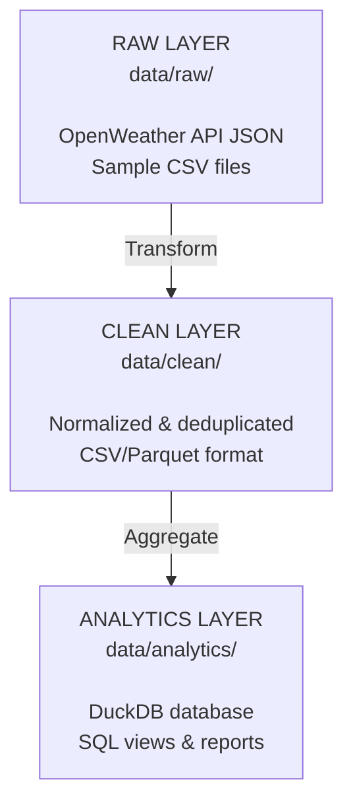

# Data Lakehouse Architecture Simulation

A complete local data lakehouse implementation with three data layers (raw, clean, analytics) and Apache Airflow orchestration. Ingests weather data from OpenWeather API and CSV files, then transforms them through a production-grade ETL pipeline.

## Quick Start

### Prerequisites

- Docker & Docker Compose (recommended)
- Python 3.11+ (for local execution)
- OpenWeather API key (free tier available)

### Setup

1. **Clone and configure**:
   ```bash
   cd /home/george/data-lakehouse-simulation
   cp .env.example .env
   # Edit .env with your OpenWeather API key
   ```

2. **Run with Docker** (recommended):
   ```bash
   docker-compose up
   ```
   
   Access Airflow Web UI: http://localhost:8081 (admin/admin)

3. **Or run locally**:
   ```bash
   python3 -m venv venv
   source venv/bin/activate
   pip install -r requirements.txt
   python3 scripts/run_pipeline.py
   ```

## Architecture

### Three-Layer Lakehouse



### Data Processing Pipeline


## Project Structure

```
data-lakehouse-simulation/
├── config/
│   └── config.py                   # Configuration & paths
├── dags/
│   ├── main_pipeline_dag.py        # Daily ETL pipeline (2 AM UTC)
│   └── data_generation_dag.py      # Weekly test data generation
├── src/
│   ├── ingestion/
│   │   ├── api_ingestion.py
│   │   └── csv_ingestion.py
│   ├── transformations/
│   │   ├── raw_to_clean.py
│   │   └── clean_to_analytics.py
│   └── analytics/
│       └── queries.py
├── scripts/
│   ├── run_pipeline.py             # Main orchestration script
│   └── generate_sample_data.py     # Test data generation
├── data/                           # Data storage (gitignored)
│   ├── raw/api/                    # Raw JSON from API
│   ├── raw/csv/                    # Raw CSV files
│   ├── clean/                      # Cleaned data
│   └── analytics/                  # DuckDB database & reports
├── .env                            # Environment variables (gitignored)
├── Dockerfile                      # Docker image definition
├── docker-compose.yml              # Container orchestration
├── airflow.cfg                     # Airflow configuration
├── requirements.txt                # Python dependencies
├── AIRFLOW.md                      # Airflow documentation
└── README.md                       # This file
```

## Features

- **Apache Airflow Orchestration**: Scheduled ETL with task groups and dependencies
- **API Integration**: Real-time weather data from OpenWeather API
- **Data Validation**: Quality checks and error handling at each stage
- **DuckDB Analytics**: Local analytical database with SQL views
- **Docker Containerization**: Consistent environment across machines
- **Comprehensive Logging**: Detailed logs at each pipeline stage
- **Type-Hinted Python**: Fully typed codebase for maintainability
- **Multi-Format Support**: JSON, CSV, Parquet data formats
- **Automated Scheduling**: Daily execution at 2 AM UTC (configurable)

## Technologies

| Component | Technology | Version |
|-----------|-----------|---------|
| Orchestration | Apache Airflow | 2.9.3 |
| Container | Docker | Latest |
| Language | Python | 3.11 |
| Database | DuckDB | Latest |
| Data Processing | Pandas | Latest |
| API Client | Requests | Latest |

## Usage

### Run Pipeline Immediately

```bash
# Option 1: Via Docker
docker exec data-lakehouse-airflow airflow dags trigger data_lakehouse_pipeline

# Option 2: Via Python script
python3 scripts/run_pipeline.py

# Option 3: Via Airflow CLI
airflow dags trigger data_lakehouse_pipeline
```

### View Live Logs

```bash
# Docker logs
docker logs -f data-lakehouse-airflow

# Or filter for specific DAG
docker logs -f data-lakehouse-airflow 2>&1 | grep data_lakehouse_pipeline
```

### Monitor Pipeline Execution

- **Web UI**: http://localhost:8081
- Click `data_lakehouse_pipeline` → `Graph` view to see task execution
- Click on individual tasks → `Log` tab for detailed logs

### Query Analytics Data

```python
from src.analytics.queries import AnalyticsQueryEngine

engine = AnalyticsQueryEngine()

# Get summary statistics
summary = engine.get_weather_summary()
print(f"Records processed: {summary['total_records']}")

# Get city temperatures
cities = engine.get_city_temperatures()
for city in cities:
    print(f"{city['city']}: {city['avg_temp']}°C")

# Generate full report
report = engine.generate_analytics_report()
```

## Output Files

After each pipeline execution, you'll find:

**Raw Data** (JSON responses from API):
- `data/raw/api/london_2025-12-22_16-12-56.json` (~800 bytes each)

**Clean Data** (normalized CSV):
- `data/clean/london_2025-12-22_16-12-56_clean.csv` (~400 bytes each)

**Analytics**:
- `data/analytics/lakehouse.duckdb` - SQLite database (780 KB)
- `data/analytics/analytics_report.json` - Summary report (13 KB)
- `data/analytics/weather_analytics.parquet` - Parquet export (7.8 KB)
- `data/analytics/daily_weather_summary.csv` - Daily aggregates
- `data/analytics/city_comparison.csv` - City-level comparison

**Example Report Output**:
```json
{
  "summary": {
    "total_cities": 5,
    "total_records": 160,
    "avg_temp_high": 22.96,
    "avg_temp_low": 10.1,
    "hottest": 35.0,
    "coldest": -5.0,
    "avg_humidity": 61.3
  }
}
```

## Configuration

### Environment Variables

Create `.env` file:
```env
OPENWEATHER_API_KEY=your_api_key_here
LOG_LEVEL=INFO
```

### Pipeline Schedule

Edit `dags/main_pipeline_dag.py`:
```python
dag = DAG(
    'data_lakehouse_pipeline',
    schedule_interval='0 2 * * *',  # Daily at 2 AM UTC
    # Other options:
    # '0 */6 * * *'  - Every 6 hours
    # '@daily'       - Daily
    # '@hourly'      - Hourly
)
```

## Troubleshooting

### Container Won't Start

```bash
# Check logs
docker-compose logs data-lakehouse-airflow

# Rebuild from scratch
docker-compose down -v
docker-compose up --build
```

### DAG Not Visible in Web UI

```bash
# Check for syntax errors
docker exec data-lakehouse-airflow airflow dags list-import-errors

# Verify DAG file
docker exec data-lakehouse-airflow python3 -m py_compile /app/dags/main_pipeline_dag.py
```

### No Output Files Generated

```bash
# Verify data is being created in container
docker exec data-lakehouse-airflow ls -la /app/data/raw/api/
docker exec data-lakehouse-airflow ls -la /app/data/clean/
docker exec data-lakehouse-airflow ls -la /app/data/analytics/
```

## Documentation

- **[AIRFLOW.md](AIRFLOW.md)** - Complete Airflow guide (scheduling, monitoring, troubleshooting)
- **[DEPLOYMENT_SUMMARY.md](DEPLOYMENT_SUMMARY.md)** - Status and quick reference

## Performance

Typical execution times:
- Ingestion: 1-2 seconds
- Transformation: 0.3-0.5 seconds
- Analytics: 0.3-0.5 seconds
- Total: ~2-3 seconds

## Security

- API keys stored in `.env` (git-ignored)
- No credentials in source code
- Airflow admin credentials in Docker (change in production)
- Environment-based configuration

## License

Open source project for educational and portfolio purposes.

## Support

For issues or questions:
1. Check [AIRFLOW.md](AIRFLOW.md) for Airflow-specific issues
2. Review Docker logs: `docker logs -f data-lakehouse-airflow`
3. Verify configuration in `.env` and `airflow.cfg`
