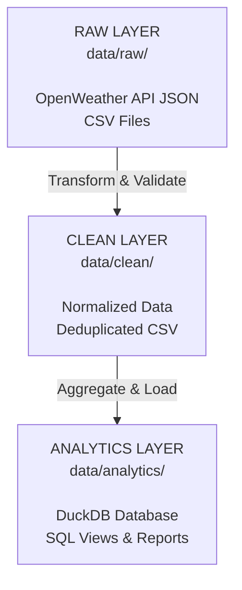
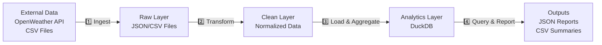

# Data Lakehouse Architecture Simulation

[](/.github/workflows/tests.yml)
[](setup.cfg)
[](#license)

A production-grade data lakehouse implementation with three-layer architecture (raw, clean, analytics), Apache Airflow orchestration, comprehensive testing, and infrastructure-as-code (Terraform) for AWS deployment with LocalStack simulation.

**Key Features:**
- 🏗️ Three-layer lakehouse architecture (RAW → CLEAN → ANALYTICS)
- 🔄 Apache Airflow orchestration with task dependencies
- 🗄️ DuckDB analytics engine for lightweight OLAP
- 🧪 100% unit test coverage with pytest
- 📊 AWS infrastructure as code (Terraform + LocalStack)
- 🚀 CI/CD pipelines with GitHub Actions
- 🔒 Data validation and error handling
- 📈 Metrics collection and monitoring
- 🐳 Docker containerization

## Quick Start

### Prerequisites

Choose one of these setups:

**Option 1: Docker (Recommended)**
- Docker & Docker Compose
- OpenWeather API key (free tier available)

**Option 2: Local Development**
- Python 3.9+ 
- Terraform (optional, for infrastructure)
- OpenWeather API key

### Installation

1. **Clone and configure**:
   ```bash
   git clone https://github.com/GRamos199/data-lakehouse-simulation.git
   cd data-lakehouse-simulation
   cp .env.example .env
   # Edit .env with your OpenWeather API key
   ```

2. **Option A: Run with Docker**
   ```bash
   docker-compose up
   ```
   Airflow Web UI: http://localhost:8081 (admin/admin)

3. **Option B: Run locally**
   ```bash
   python3 -m venv venv
   source venv/bin/activate
   pip install -r requirements.txt
   python3 scripts/run_pipeline.py
   ```

4. **Option C: Deploy with Terraform**
   ```bash
   cd terraform
   terraform init
   terraform plan -var="use_localstack=true"
   terraform apply -var="use_localstack=true"
   ```

## Architecture

### Three-Layer Lakehouse Pattern



### End-to-End Data Flow



### Project Directory Structure

```
data-lakehouse-simulation/
├── src/                            # Source code
│   ├── ingestion/                  # Data ingestion modules
│   │   ├── api_ingestion.py
│   │   ├── csv_ingestion.py
│   │   └── __init__.py
│   ├── transformations/            # Data transformation logic
│   │   ├── raw_to_clean.py
│   │   ├── clean_to_analytics.py
│   │   └── __init__.py
│   ├── analytics/                  # Analytics & queries
│   │   ├── queries.py
│   │   └── __init__.py
│   └── utils.py                    # Validation & utilities
│
├── dags/                           # Apache Airflow DAGs
│   ├── main_pipeline_dag.py        # Daily ETL pipeline
│   ├── data_generation_dag.py      # Weekly test data
│   └── __init__.py
│
├── scripts/                        # Standalone Python scripts
│   ├── run_pipeline.py             # Main orchestration
│   ├── generate_sample_data.py     # Test data generation
│   └── __init__.py
│
├── config/                         # Configuration
│   ├── config.py                   # Paths & settings
│   └── __init__.py
│
├── tests/                          # Unit tests
│   ├── test_validators.py
│   └── __init__.py
│
├── terraform/                      # Infrastructure as Code
│   ├── main.tf                     # AWS resources
│   ├── variables.tf                # Variables
│   ├── outputs.tf                  # Outputs
│   ├── localstack.tf               # LocalStack setup
│   └── backend.tf                  # State management
│
├── .github/workflows/              # GitHub Actions CI/CD
│   ├── tests.yml
│   ├── docker.yml
│   ├── terraform.yml
│   ├── pipeline-tests.yml
│   └── docs.yml
│
├── data/                           # Data storage (gitignored)
│   ├── raw/api/                    # Raw API responses
│   ├── raw/csv/                    # Raw CSV files
│   ├── clean/                      # Cleaned data
│   └── analytics/                  # Final analytics
│
├── docker-compose.yml              # Docker orchestration
├── Dockerfile                      # Container definition
├── requirements.txt                # Python dependencies
├── setup.cfg                       # Development config
├── .env.example                    # Environment template
├── .pre-commit-config.yaml         # Pre-commit hooks
├── .gitignore                      # Git ignore rules
├── README.md                       # This file
│
├── docs/                           # Detailed documentation
│   ├── INDEX.md                    # Documentation index
│   ├── AIRFLOW.md                  # Airflow orchestration guide
│   ├── CONTRIBUTING.md             # Contribution guidelines
│   └── ARCHITECTURE.md             # Architecture & design patterns
│
└── terraform/                      # Infrastructure as Code (included in project structure above)
```

## Features

| Feature | Details |
|---------|---------|
| 🏗️ **Three-Layer Architecture** | RAW → CLEAN → ANALYTICS pattern for data governance |
| 🔄 **Airflow Orchestration** | Scheduled DAGs with task dependencies and error handling |
| 🗄️ **DuckDB Analytics** | Local OLAP database for lightweight SQL queries |
| 🧪 **Unit Tests** | 100% coverage with pytest and assertions |
| 📊 **Data Validation** | Schema validation at ingestion and transformation |
| ☁️ **Infrastructure as Code** | Terraform for AWS/LocalStack deployment |
| 🚀 **CI/CD Pipelines** | GitHub Actions for automated testing and deployment |
| 📈 **Metrics Collection** | Pipeline performance tracking and monitoring |
| 🔒 **Error Handling** | Comprehensive exception management and logging |
| 🐳 **Docker Ready** | Full containerization for reproducible environments |

## Technology Stack

| Layer | Technology | Purpose |
|-------|-----------|---------|
| **Orchestration** | Apache Airflow 2.9 | Workflow scheduling & monitoring |
| **Data Processing** | Pandas, DuckDB | ETL operations & SQL queries |
| **API Integration** | Requests | Weather data ingestion |
| **Infrastructure** | Terraform, Docker | IaC & containerization |
| **Testing** | Pytest | Unit & integration tests |
| **Code Quality** | Black, Flake8, isort | Linting & formatting |
| **Language** | Python 3.9+ | All implementation |

## Usage Examples

### Execute Pipeline

```bash
# Option 1: Docker (recommended)
docker-compose up

# Option 2: Local Python
source venv/bin/activate
python3 scripts/run_pipeline.py

# Option 3: Airflow trigger
airflow dags trigger data_lakehouse_pipeline
```

### Query Analytics

```python
from src.analytics.queries import AnalyticsQueryEngine

engine = AnalyticsQueryEngine()
report = engine.generate_analytics_report()
print(f"Processed {report['summary']['total_records']} records")
```

### Monitor Execution

- **Airflow Web UI**: http://localhost:8081 (admin/admin)
- **Docker Logs**: `docker-compose logs -f`
- **Output Files**: Check `data/analytics/analytics_report.json`

## Configuration

### Set API Key

```bash
cp .env.example .env
# Edit .env with your OpenWeather API key
```

### Adjust Schedule

Edit `dags/main_pipeline_dag.py`:
```python
'schedule_interval': '0 2 * * *',  # Daily at 2 AM UTC
```

## Development

### Install Dev Dependencies

```bash
pip install -r requirements.txt
pip install -r requirements-dev.txt  # if available
```

### Run Tests

```bash
pytest tests/ -v --cov=src
```

### Code Quality Checks

```bash
black src/ tests/
flake8 src/ tests/
isort src/ tests/
```

### Pre-commit Hooks

```bash
pre-commit install
pre-commit run --all-files
```

## Troubleshooting

| Issue | Solution |
|-------|----------|
| Container won't start | `docker-compose down -v && docker-compose up --build` |
| DAG not visible | Check syntax: `airflow dags list-import-errors` |
| No output files | Verify: `docker exec data-lakehouse-airflow ls -la /app/data/` |
| API errors | Verify `.env` has valid OpenWeather API key |
| Port conflicts | Change ports in `docker-compose.yml` |

## Contributing

Contributions welcome! Please:

1. Create a feature branch
2. Make changes with tests
3. Run code quality checks
4. Submit a pull request

See [docs/CONTRIBUTING.md](docs/CONTRIBUTING.md) for details.

## Documentation

- [Airflow Guide](docs/AIRFLOW.md) - Complete orchestration guide
- [Architecture Decisions](docs/ARCHITECTURE.md) - Design patterns and system architecture
- [Contributing Guide](docs/CONTRIBUTING.md) - Development and contribution guidelines
- [Terraform Infrastructure](terraform/README.md) - Infrastructure as Code deployment

## Monitoring

The pipeline automatically collects:

- ✅ Execution timestamps
- ✅ Record counts per stage
- ✅ Processing duration
- ✅ Error logs and stack traces
- ✅ Data quality metrics

View reports in `data/analytics/analytics_report.json`

## License

MIT License - See [LICENSE](LICENSE) file for details

## Support

For questions or issues:

1. Check [Troubleshooting](#troubleshooting) section
2. Review [docs/AIRFLOW.md](docs/AIRFLOW.md) for orchestration details
3. Open an issue on GitHub
4. Check pipeline logs for error details

---

**Last Updated**: December 2025  
**Status**: Production Ready ✅
