# Apache Airflow Documentation

Complete guide to running the data lakehouse pipeline with Apache Airflow orchestration.

## Table of Contents

1. [Overview](#overview)
2. [Quick Start](#quick-start)
3. [How It Works](#how-it-works)
4. [Scheduling](#scheduling)
5. [Data Flow](#data-flow)
6. [Monitoring & Logs](#monitoring--logs)
7. [Troubleshooting](#troubleshooting)

---

## Overview

Airflow is a workflow orchestration tool that automatically manages the data lakehouse pipeline. It handles:

- **Scheduling**: Runs the pipeline automatically on a fixed schedule
- **Monitoring**: Tracks task execution status and logs
- **Retries**: Automatically retries failed tasks
- **Alerting**: Reports failures (optional)
- **History**: Maintains execution history for auditing

### Architecture

```mermaid
graph TB
    subgraph web["🌐 Web Interface"]
        UI["Airflow Web UI<br/>Port 8081<br/>- Monitor DAGs<br/>- View Logs<br/>- Trigger DAGs"]
    end
    
    subgraph core["⚙️ Airflow Core"]
        WS["Webserver"]
        SC["Scheduler"]
        DB["Metadata DB<br/>SQLite"]
        
        WS <--> SC
        WS <--> DB
        SC <--> DB
    end
    
    subgraph dags["📊 Workflows"]
        DAG1["data_lakehouse_pipeline<br/>Daily @ 2 AM UTC"]
        DAG2["data_generation_pipeline<br/>Weekly Sunday"]
    end
    
    UI -.->|Monitor| WS
    SC -->|Execute| DAG1
    SC -->|Execute| DAG2
    
```



---

## Quick Start

### 1. Start Airflow with Docker

```bash
cd /home/george/data-lakehouse-simulation
docker-compose up
```

This command:
- Builds the Docker image with Python 3.11, Airflow, and all dependencies
- Starts the Airflow webserver on port 8081
- Starts the scheduler daemon
- Initializes the SQLite metadata database
- Creates the admin user (admin/admin)

**Expected output:**
```
data-lakehouse-airflow | [2025-12-22T16:00:00+0000] Airflow webserver started on 0.0.0.0:8081
data-lakehouse-airflow | [2025-12-22T16:00:05+0000] Scheduler started
```

### 2. Access the Web UI

- **URL**: http://localhost:8081
- **Username**: admin
- **Password**: admin

### 3. View Live Logs

```bash
docker logs -f data-lakehouse-airflow
```

### 4. Stop Airflow

```bash
docker-compose down
```

---

## How It Works

### DAG: `data_lakehouse_pipeline`

The main production pipeline that processes weather data through all three layers.

**Configuration:**
- **Schedule**: Every day at 2:00 AM UTC (`0 2 * * *`)
- **Tasks**: 4 sequential task groups
- **Retries**: 2 automatic retries on failure
- **Retry Delay**: 5 minutes between attempts

**Task Flow:**

```
[ingestion_stage]
    ↓ (fetch_and_ingest_data)
    Extracts weather data from OpenWeather API and loads raw JSON files
    to /app/data/raw/api/
    
[transformation_stage]
    ↓ (normalize_and_clean_data)
    Cleans, deduplicates, and normalizes data
    Exports to /app/data/clean/ as CSV/Parquet
    
[analytics_stage]
    ↓ (create_analytics_tables)
    Loads cleaned data into DuckDB
    Creates SQL views and aggregations
    Generates analytics_report.json
    
[verify_output]
    ✓ Health check bash operator
    Verifies all output files exist
```

### DAG: `data_generation_pipeline`

Generates fresh sample data for testing purposes.

**Configuration:**
- **Schedule**: Every Sunday at 00:00 UTC (`0 0 * * 0`)
- **Tasks**: 1 task (generate_sample_data)
- **Purpose**: Create fresh test dataset weekly

---

## Scheduling

### Understanding Cron Expressions

The pipeline uses standard cron syntax:

```
Minute  Hour  Day-of-Month  Month  Day-of-Week
  0      2        *          *        *

↓ Meaning: At 02:00 (2 AM) every day
```

### Timezone

All times are in **UTC (Coordinated Universal Time)**

**Common conversions:**
- 02:00 UTC = 21:00 EST (9 PM Eastern)
- 02:00 UTC = 18:00 PST (6 PM Pacific)
- 02:00 UTC = 11:00 IST (11 AM India Standard)

### Modifying Schedule

To change when the pipeline runs, edit `dags/main_pipeline_dag.py`:

```python
default_args = {
    'owner': 'data-engineer',
    'start_date': datetime(2025, 12, 22),
    'retries': 2,
    'retry_delay': timedelta(minutes=5),
}

dag = DAG(
    'data_lakehouse_pipeline',
    default_args=default_args,
    schedule_interval='0 2 * * *',  # <- Change this (cron expression)
    tags=['lakehouse'],
)
```

**Common schedules:**
- `'0 2 * * *'` - Every day at 2 AM
- `'0 */6 * * *'` - Every 6 hours
- `'0 0 * * 0'` - Every Sunday at midnight
- `'0 0 1 * *'` - First day of each month
- `'@daily'` - Daily (shorthand)
- `'@hourly'` - Hourly (shorthand)

---

## Data Flow

### Complete Pipeline Execution

```
STAGE 1: DATA INGESTION
├── Input: OpenWeather API (5 cities)
├── Process: Fetch JSON data
├── Output: /app/data/raw/api/*.json
│   Example: london_2025-12-22_16-12-56.json
│   Size: ~800 bytes per file
└── Status: Logged as "✓ Ingestion complete"

STAGE 2: TRANSFORMATION
├── Input: /app/data/raw/api/*.json + CSV files
├── Process: Clean, normalize, deduplicate
├── Output: /app/data/clean/*.csv
│   Example: london_2025-12-22_16-12-56_clean.csv
│   Size: ~400 bytes per file
└── Status: Logged as "✓ Transformation complete"

STAGE 3: ANALYTICS
├── Input: /app/data/clean/*.csv
├── Process: Load into DuckDB, create views
├── Output: /app/data/analytics/
│   - analytics_report.json (13 KB)
│   - weather_analytics.parquet (7.8 KB)
│   - daily_weather_summary.csv (6.1 KB)
│   - city_comparison.csv (880 bytes)
│   - lakehouse.duckdb (780 KB database)
└── Status: Logged as "✓ Analytics complete"

STAGE 4: HEALTH CHECK
├── Input: Output files from all stages
├── Process: Verify files exist and have content
├── Output: Success/Failure status
└── Status: Bash operator verifies output
```

### Example Output Files

**Raw Layer (JSON)**:
```json
{
  "city_name": "London",
  "country": "GB",
  "temperature": 12.5,
  "humidity": 65,
  "weather": "Partly Cloudy",
  "timestamp": "2025-12-22T16:12:56Z"
}
```

**Clean Layer (CSV)**:
```csv
city,date,temperature_high,temperature_low,condition,humidity
London,2025-12-22,16.9,12.5,Partly Cloudy,49
Tokyo,2025-12-22,21.2,-3.7,Rainy,86
```

**Analytics Report (JSON)**:
```json
{
  "summary": {
    "total_cities": 5,
    "total_records": 160,
    "avg_temp_high": 22.96,
    "avg_temp_low": 10.1,
    "hottest": 35.0,
    "coldest": -5.0,
    "avg_humidity": 61.3
  },
  "city_temperatures": [...],
  "weather_distribution": [...],
  "extreme_events": [...]
}
```

---

## Monitoring & Logs

### Web UI Dashboard

Access http://localhost:8081 to:

1. **View DAG Status**
   - Click "data_lakehouse_pipeline" → "Graph" view
   - Green boxes = Success
   - Red boxes = Failed
   - Blue boxes = Running

2. **View Task Logs**
   - Click "data_lakehouse_pipeline" → "Grid" view
   - Find the execution date/time
   - Click on task → "Log" tab
   - Scroll to see detailed execution logs

3. **Trigger Pipeline Manually**
   - Click "data_lakehouse_pipeline"
   - Click the play icon (▶) or "Trigger DAG" button
   - Watch real-time execution in Graph view

### Real-Time Terminal Logs

```bash
# Watch all logs as they happen
docker logs -f data-lakehouse-airflow

# Filter for specific DAG
docker logs -f data-lakehouse-airflow 2>&1 | grep data_lakehouse_pipeline

# Filter for errors only
docker logs -f data-lakehouse-airflow 2>&1 | grep -i error
```

### Log File Locations

Inside container:
```
/airflow/logs/
├── dag_id=data_lakehouse_pipeline/
│   ├── run_id=2025-12-22T16:12:53+00:00/
│   │   ├── task_id=ingestion_stage.fetch_and_ingest_data/attempt=1.log
│   │   ├── task_id=transformation_stage.normalize_and_clean_data/attempt=1.log
│   │   ├── task_id=analytics_stage.create_analytics_tables/attempt=1.log
│   │   └── task_id=verify_output/attempt=1.log
│   └── run_id=2025-12-22T10:00:00+00:00/
│       └── ... (previous execution)
└── dag_processor_manager/
```

Access logs directly:
```bash
# Read specific task log
docker exec data-lakehouse-airflow cat "/airflow/logs/dag_id=data_lakehouse_pipeline/run_id=manual__2025-12-22T16:12:53+00:00/task_id=ingestion_stage.fetch_and_ingest_data/attempt=1.log"
```

### Understanding Log Output

Each task produces logs with structure:

```
[TIMESTAMP] {module.py:LINE} LEVEL - MESSAGE
[2025-12-22T16:12:59.600+0000] {run_pipeline.py:109} INFO - ================================================================================
[2025-12-22T16:12:59.600+0000] {run_pipeline.py:110} INFO - STAGE 3: ANALYTICS LAYER (CLEAN → ANALYTICS)
[2025-12-22T16:12:59.600+0000] {run_pipeline.py:114} INFO - [3.1] Creating analytical tables in DuckDB...
[2025-12-22T16:12:59.601+0000] {clean_to_analytics.py:183} INFO - Starting clean to analytics transformations...
```

**Log Levels:**
- `INFO` - Normal operation information
- `WARNING` - Potential issue but execution continues
- `ERROR` - Task failed
- `DEBUG` - Detailed diagnostic information

---

## Troubleshooting

### Issue: DAG Not Appearing in Web UI

**Cause**: DAG file has Python syntax errors

**Solution**:
```bash
# Check DAG syntax
docker exec data-lakehouse-airflow airflow dags list-import-errors

# Manually verify DAG file
docker exec data-lakehouse-airflow python3 -m py_compile /app/dags/main_pipeline_dag.py
```

### Issue: Task Failed with "Module Not Found"

**Cause**: Missing Python package in Docker image

**Solution**:
1. Add package to `requirements.txt`
2. Rebuild Docker image:
   ```bash
   docker-compose down
   docker-compose up --build
   ```

### Issue: No Data Being Generated

**Cause**: Usually API key issue or no internet connection from container

**Solution**:
1. Verify `.env` file has correct API key
2. Test API access from container:
   ```bash
   docker exec data-lakehouse-airflow python3 << 'EOF'
   import requests
   from dotenv import load_dotenv
   import os
   
   load_dotenv('/app/.env')
   api_key = os.getenv('OPENWEATHER_API_KEY')
   
   url = f"https://api.openweathermap.org/data/2.5/weather?q=London&appid={api_key}"
   response = requests.get(url)
   print(f"Status: {response.status_code}")
   print(f"Response: {response.json()}")
   EOF
   ```

### Issue: Database Lock Error

**Cause**: SQLite database locked by another process

**Solution**:
```bash
# Restart the container
docker restart data-lakehouse-airflow

# Or clear database and restart
docker-compose down
docker-compose up --build
```

### Issue: Disk Space Issues

**Cause**: DuckDB database or logs growing too large

**Solution**:
```bash
# Check container size
docker exec data-lakehouse-airflow du -sh /app/data/analytics/

# Clear old logs (keep latest 7 days)
docker exec data-lakehouse-airflow find /airflow/logs -type f -mtime +7 -delete

# Clean up Docker resources
docker-compose down -v  # Removes volumes
```

### Issue: Pipeline Runs But Produces No Output

**Cause**: Data files are written but might not be syncing properly

**Solution**:
```bash
# Verify data exists in container
docker exec data-lakehouse-airflow ls -lah /app/data/raw/api/
docker exec data-lakehouse-airflow ls -lah /app/data/clean/
docker exec data-lakehouse-airflow ls -lah /app/data/analytics/

# Verify data synced to host
ls -lah /home/george/data-lakehouse-simulation/data/raw/api/
ls -lah /home/george/data-lakehouse-simulation/data/clean/
ls -lah /home/george/data-lakehouse-simulation/data/analytics/
```

---

## Advanced Configuration

### Change Execution Environment

To use a different executor instead of LocalExecutor, edit `airflow.cfg`:

```ini
[core]
executor = LocalExecutor
# Change to:
executor = SequentialExecutor  # Single task at a time (slower)
# executor = CeleryExecutor   # Distributed (requires Redis/Rabbit)
```

### Add Slack Notifications

```python
from airflow.models import Variable
from airflow.exceptions import AirflowException

def send_slack_notification(context):
    slack_webhook = Variable.get("SLACK_WEBHOOK_URL")
    message = f"Task {context['task_instance'].task_id} failed!"
    # Send to Slack...

dag = DAG(
    'data_lakehouse_pipeline',
    # ... other config ...
    on_failure_callback=send_slack_notification,
)
```

### Enable Email Alerts

```python
default_args = {
    'owner': 'data-engineer',
    'email': ['alerting-team@example.com'],
    'email_on_failure': True,
    'email_on_retry': False,
    'retries': 2,
}
```

### Scale with Multiple DAG Files

Create separate DAG files for different purposes:
```
dags/
├── main_pipeline_dag.py          # Daily ETL
├── data_generation_dag.py        # Weekly data gen
├── maintenance_dag.py            # Cleanup jobs
└── custom_analysis_dag.py        # Custom workflows
```

Airflow automatically discovers all `.py` files in the `dags/` folder.

---

## Performance Optimization

### Reduce Task Execution Time

**Current performance:**
- Ingestion: ~1.35 seconds
- Transformation: ~0.27 seconds
- Analytics: ~0.36 seconds
- Total: ~7.5 seconds

**Optimization strategies:**
1. Parallelize task groups (if independent)
2. Add data filtering at ingestion stage
3. Use Parquet instead of CSV for larger datasets
4. Implement caching for frequently computed values

### Monitor Resource Usage

```bash
# Check Docker container resource usage
docker stats data-lakehouse-airflow

# Expected (lightweight):
# CONTAINER ID  CPU %  MEM USAGE / LIMIT  MEM %
# abc123        2.1%   215MB / 8GB        2.7%
```

---

## Maintenance

### Backup Database

```bash
# Export Airflow metadata database
docker exec data-lakehouse-airflow cp /airflow/airflow.db /app/airflow_backup.db
docker cp data-lakehouse-airflow:/app/airflow_backup.db ./backups/

# Or use SQLite command
docker exec data-lakehouse-airflow sqlite3 /airflow/airflow.db ".dump" > airflow_backup.sql
```

### Clear Execution History

```bash
# Keep only last 90 days of logs
docker exec data-lakehouse-airflow airflow db clean --days-to-delete 90 --confirm

# Clear specific DAG history
docker exec data-lakehouse-airflow airflow tasks clear data_lakehouse_pipeline
```

### Upgrade Airflow Version

1. Update `requirements.txt`:
   ```
   apache-airflow==2.10.0  # Change version
   ```

2. Rebuild container:
   ```bash
   docker-compose down
   docker-compose up --build
   ```

---

## Support & Documentation

- **Airflow Official Docs**: https://airflow.apache.org/docs/
- **DuckDB Documentation**: https://duckdb.org/docs/
- **OpenWeather API**: https://openweathermap.org/api

## Contact

For issues or questions about this pipeline, check the project README or contact the data engineering team.
